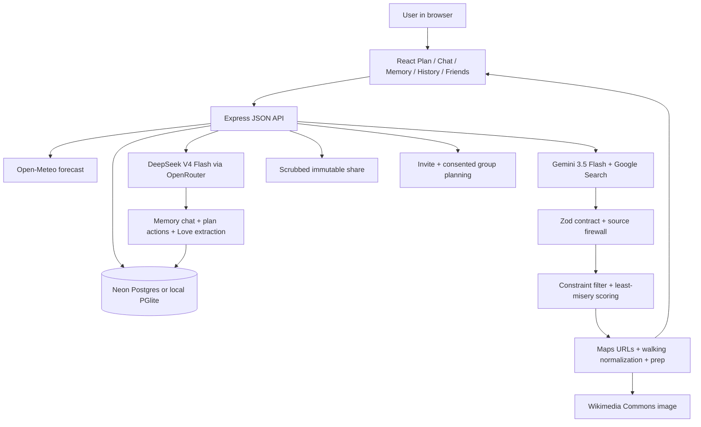
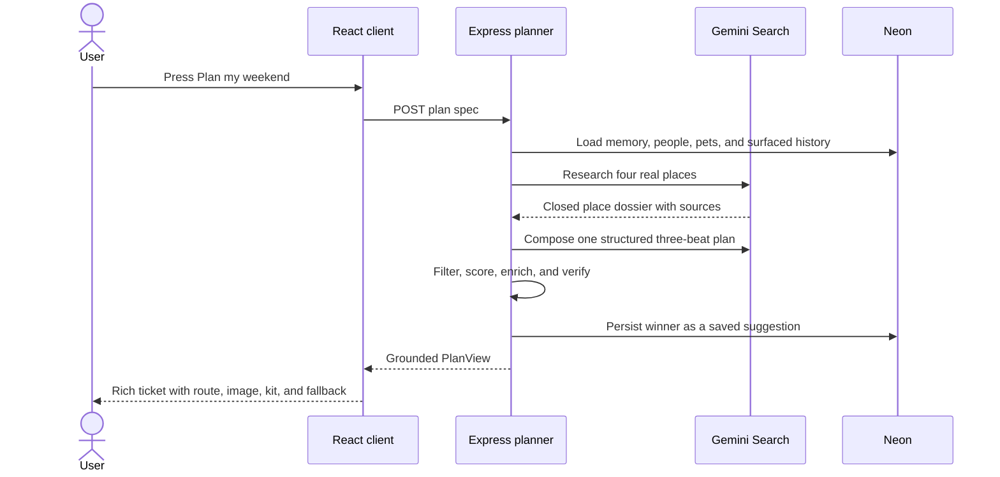
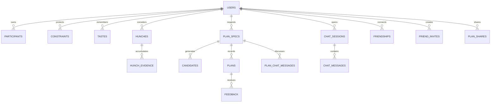

# PlanBuddy

**A memory-aware planner that turns one click into one grounded, decision-ready plan for a person, household, and pets.**

## Purpose

PlanBuddy removes the work between “we should go out” and an itinerary worth
following. It is built for Diogo’s Buddy app family and supports a day off,
weekend, getaway, or vacation in one product. Its durable advantage is an
inspectable memory of the household’s tastes, constraints, feedback, family
members, and pets, so it asks fewer questions over time without learning hidden
or unsafe rules.

## What it does

- Produces one three-beat plan rather than a generic list of ideas.
- Grounds every named place in a web-sourced dossier and mechanically rejects
  names or source links that are not in that dossier.
- Shows real stops, Maps search/directions/full-route links, an attributed place
  image, estimated distances and spend, live weather, detailed clothing and
  bring lists, a pet kit, operational checks, and one compact fallback.
- Remembers household members and pets, hard constraints, loved/avoided tastes,
  and weak feedback-derived hunches with visible provenance and CRUD controls.
- Uses Like, Dislike, Love, ratings, comments, and rejection reasons in a
  guarded self-improvement loop. Love extracts a visible summary of reusable
  event features; hunches can become tastes but never safety constraints.
- Lets Buddy run every plan-level action and make reversible, surgical edits:
  swap only the restaurant, retime lunch to dinner, lower cost, or reduce walking.
- Connects friends through one-time invites. Selected friends contribute their
  verified needs and explicit tastes without exposing raw memory or history.
- Shares immutable, privacy-scrubbed itineraries through private expiring links.
- Saves every surfaced suggestion before selection. History can reopen, rate,
  share, or lock it later, while recent titles and venue names prevent repeats.
- Persists accounts and planning history in Neon Postgres and runs publicly on
  Render with email/password login.

## How it works

The user chooses a scale, date, and participants, optionally adds one sentence
of context, and presses **Plan my weekend**. The server gathers the relevant
memory, selected people and pets, recent plan history, home location, and an
Open-Meteo forecast. Gemini with Google Search builds a closed dossier containing
a meal venue, two distinct outdoor stops, and a fallback venue; a second
structured call composes exactly one chronological three-beat itinerary using
only those places. Empty Gemini dossier responses retry once, then fall back to
grounded DeepSeek web search. If grounding is still unavailable, production
reports that honestly instead of substituting generic demo content.

Server code then validates citations and constraint claims, rejects any place
outside the dossier, scores group fit using least-misery logic, and enriches the
winner. Enrichment creates Google Maps URLs, reconciles total walking time with
an explicit remembered range, adds an operational checklist, chooses an
attributed Wikimedia Commons image, and derives weather-aware clothing and pet
preparation. The surfaced winner is immediately persisted as `suggested`; Lock
or Not-this transitions that same record in place. The next planning request
sends recent titles and venue names back to discovery as exclusions and applies
a second deterministic overlap penalty. DeepSeek V4 Flash separately powers chat,
Love feature extraction, and plan-action interpretation. Plan-scoped chat stores
an append-only revision trail, so the original is always one tap away.

## Architecture





## Tech stack

| Layer | Technology |
|---|---|
| Frontend | React 18, Vite 6, TypeScript, React Router, Lucide icons |
| Backend | Express 4, TypeScript, Zod validation |
| Data | Neon Postgres in production, embedded PGlite locally/tests |
| AI | Gemini 3.5 Flash + Google Search for plans; DeepSeek V4 Flash via OpenRouter for chat/feedback and composition fallback |
| Context | Open-Meteo weather, Google Maps URLs, Wikimedia Commons images |
| Auth | Email/password, Argon2id or bcrypt, opaque signed-cookie sessions |
| Hosting | Render web service in Frankfurt; Neon database in Frankfurt |
| QA | Vitest, Supertest, Playwright mobile Chrome |

## Repo map

| Path | Responsibility |
|---|---|
| `src/client/routes/` | Plan, Chat, Memory, History, Friends, invite, share, authentication, and onboarding screens |
| `src/client/components/TicketCard.tsx` | Rich recommendation and saved-plan presentation |
| `src/server/grounding/geminiPlaces.ts` | Google Search dossier and structured plan composition |
| `src/server/plans/engine/` | Constraint firewall, scoring, generation pipeline, Maps/preparation enrichment |
| `src/server/plans/plan-chat.routes.ts` | Persistent action-capable Buddy and reversible plan revisions |
| `src/server/friends/` / `src/server/shares/` | Friend consent, private group planning, and scrubbed share snapshots |
| `src/server/media/wikimedia.ts` | Cached, attributable Commons place-image selection |
| `src/server/ai/` | DeepSeek calls, prompts, guarded JSON parsing, deterministic demo AI |
| `src/server/weather/` | Open-Meteo forecast retrieval and cache |
| `src/server/db/` | Postgres/PGlite client and migrations |
| `tests/` and `e2e/` | Unit, contract, integration, and browser coverage |
| `PRODUCT-CONTRACT.md` | Product invariants and learning rules |
| `STATE.md` / `PROGRESS.md` | Current status, roadmap, and next actions |

## Data & state

Production data lives in the `planbuddy` schema of a dedicated Neon project.
Candidate payloads are JSONB so richer route, image, preparation, and fallback
fields require no migration. Every surfaced winner also has a `plans` snapshot
whose status moves from `suggested` to `locked` or `rejected` without creating a
duplicate. Raw chat is bounded and retained for 30 days;
durable memory is structured and visible.



## External integrations

- **Google Gemini API** — native Search grounding plus structured itinerary
  composition. Reads `GEMINI_API_KEY` or local `GEMINI_API_KEY_FILE`.
- **OpenRouter / DeepSeek V4 Flash** — chat, feedback extraction, and bounded
  composition fallback. Reads `OPENROUTER_API_KEY` or local key-file path.
- **Open-Meteo** — no-key weather forecast and geocoding.
- **Google Maps URLs** — no-key server-generated search and directions links.
- **Wikimedia Commons API** — no-key, cached route photography with attribution.
- **Neon** — persistent Postgres via `DATABASE_URL`.
- **Render** — builds and serves the single Node production process.

## How to run

```bash
npm install
npm run dev

# Production-style local process
npm run build
npm start
```

- **Entry points:** `src/client/main.tsx`, `src/server/index.ts`
- **Live URL:** https://planbuddy.onrender.com
- **Repository:** https://github.com/dmcaetano/planbuddy
- **Configuration:** copy `.env.example`; never commit filled secrets.

## Status

Version 0.1.5 “Long Memory” saves every surfaced suggestion, recovers earlier
unselected winners, prevents venue/title repeats, and lets History reopen, rate,
share, or lock suggestions. See `STATE.md`,
`PROGRESS.md`, and `QA-REPORT.md` for release evidence and next work.

## Glossary

- **Dossier** — the four source-backed places the composer is allowed to name.
- **Venue firewall** — server validation rejecting any place/source outside the dossier.
- **Hunch** — weak feedback-derived preference evidence that can decay or promote to a taste.
- **Least misery** — group-fit score based on the least-satisfied participant.
